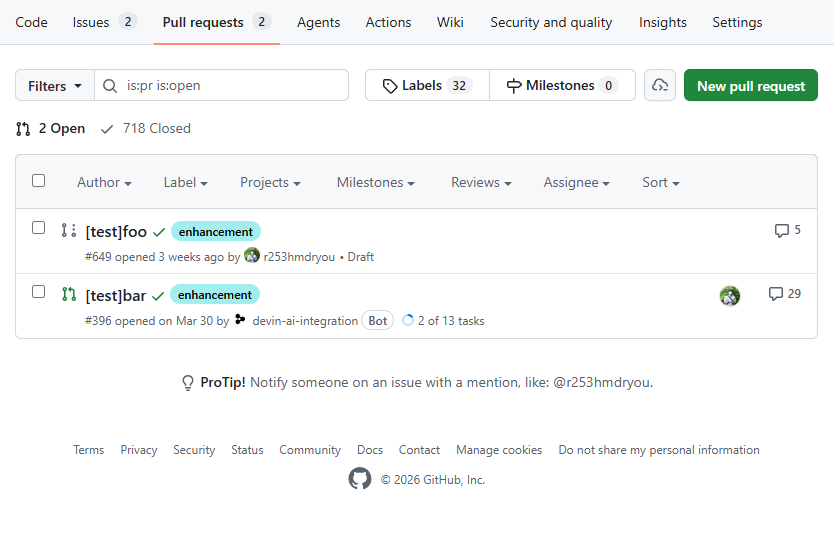

# GitHub Goggles

Chrome extension that adds small visual hints to GitHub pull request list pages.



## Install locally

```sh
pnpm install
pnpm build
```

1. Open `chrome://extensions`.
2. Enable **Developer mode**.
3. Choose **Load unpacked**.
4. Select this repository directory.

Open a GitHub repository's pull request list, such as `https://github.com/OWNER/REPO/pulls`.

## Development

```sh
pnpm build
pnpm check
```
